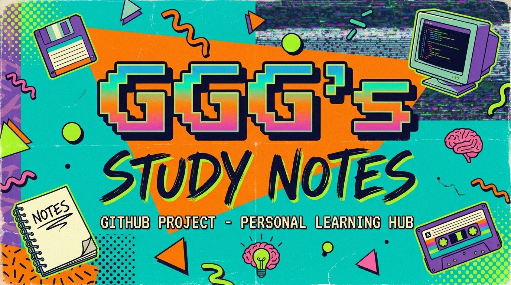

<p align="center">
  
</p>

# GGG's Study Notes

欢迎来到我的学习笔记仓库 📚

这里更像一座持续生长的个人知识库，而不只是一个简单的备份仓库。我会把平时学习中觉得值得沉淀的内容整理成 Markdown 笔记，主题覆盖计算机基础、编程语言、前端开发、算法、机器学习、英语学习、考研复习，以及一些项目灵感和长期计划。

如果你也正在自学、复习、准备面试，或者只是想看看别人是怎么搭建自己的知识体系的，希望这里能给你一点启发，也帮你少走一点弯路。

## ✨ 这里有什么

- 近 90 篇持续整理中的 Markdown 笔记
- 以 `notes/` 为核心的个人知识管理体系
- 计算机基础到项目实践的长期积累
- 英语、考研、学习计划等配套学习内容
- 用于日常同步与备份的脚本和资源文件

## 🗂️ 内容导航

你可以从这些方向开始逛：

- `notes/计算机`：编程语言、算法、理论知识、数据库、机器学习、技术基础
- `notes/Web Develop`：HTML、CSS、JavaScript、React、Vue3、Node.js、webpack 等前端内容
- `notes/projects`：项目记录、网页练习、模板与灵感草稿
- `notes/英语`：单词、短语、听力、学习计划
- `notes/考研`：高数、线代、英语、408
- `notes/学习计划`：路线图、待办事项、阶段安排
- `notes/Game Deasign`、`notes/建模`、`notes/WatchList`：兴趣拓展和日常积累

## 🚀 推荐阅读入口

如果你是第一次来到这个仓库，可以先看看这些内容：

- [Obsidian 笔记指南](notes/Obsidian%20%E7%AC%94%E8%AE%B0%E6%8C%87%E5%8D%97.md)
- [网站开发学习路线](notes/%E5%AD%A6%E4%B9%A0%E8%AE%A1%E5%88%92/%E7%BD%91%E7%AB%99%E5%BC%80%E5%8F%91%E5%AD%A6%E4%B9%A0%E8%B7%AF%E7%BA%BF.md)
- [LeetCode Hot 100](notes/%E8%AE%A1%E7%AE%97%E6%9C%BA/%E7%AE%97%E6%B3%95%20Algorithms/LeetCode%20Hot%20100.md)
- [React](notes/Web%20Develop/%E5%89%8D%E7%AB%AF%20Frontend/React.md)
- [MySQL](notes/%E8%AE%A1%E7%AE%97%E6%9C%BA/%E6%95%B0%E6%8D%AE%E5%BA%93%20DataBase/MySQL.md)
- [SaaS Stack](notes/SaaS%20Stack.md)

## 🧱 仓库结构

```text
.
├─ assets/                # README 配图等资源
├─ notes/                 # 核心笔记内容
│  ├─ 计算机
│  ├─ Web Develop
│  ├─ 英语
│  ├─ 考研
│  ├─ 学习计划
│  ├─ projects
│  └─ ...
├─ note_update.bat        # 本地同步脚本
└─ README.md
```

## 🧠 我是怎么使用这个仓库的

这个仓库本质上是我的第二大脑之一，主要服务于下面几件事：

- 学习新知识时快速记录
- 复习旧内容时重新整理结构
- 把零散的知识点慢慢串成体系
- 给未来的自己留下一份可追溯、可复用的学习档案

如果你想本地查看，最推荐的方式是：

1. 克隆这个仓库。
2. 用 Obsidian 或任意 Markdown 编辑器打开 `notes/`。
3. 按自己的兴趣从专题目录开始阅读。

## 🌱 为什么愿意公开这些笔记

我一直很喜欢“边学边分享”这件事。

很多时候，一份并不完美但真实可见的学习记录，比一篇过度包装的总结更有价值。它能展示一个人是怎么理解概念、怎么踩坑、怎么慢慢搭起自己的知识框架的。这个仓库也是同样的想法：一边学习，一边整理，一边把过程留下来。

如果这些内容刚好帮到了你，那这份分享就已经很值得了。

## 📝 说明

- 这是一份长期更新中的个人学习仓库，内容会持续调整和补充。
- 部分笔记更偏向个人理解与复习提纲，不一定是完整教程。
- 仓库中保留了一些面向我个人环境的脚本和配置，主要用于同步与备份。

## 💬 最后

如果你也喜欢知识管理、长期主义学习、把输入慢慢变成自己的东西，欢迎来这里随便看看 ✨

也欢迎你把这里当作一个参考样本，去搭建属于你自己的学习仓库。
