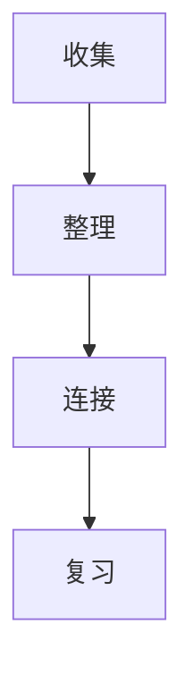

# Obsidian 笔记指南

> [!info] 使用场景
> Obsidian 适合做本地优先的知识库、技术笔记、项目资料、读书笔记、任务记录和个人 Wiki。它把笔记保存在普通 Markdown 文件里，核心能力来自链接、标签、属性、搜索、插件和可视化视图。

相关笔记：[[SSH]] | [[FTP]] | [[WSL]] | [[Termimal & Shell Tools]]

## 快速索引

| 我想做什么 | 快速入口或语法 |
| --- | --- |
| 新建笔记 | `Ctrl+N` / `Cmd+N` |
| 打开或创建笔记 | Quick switcher：`Ctrl+O` / `Cmd+O` |
| 打开命令面板 | `Ctrl+P` / `Cmd+P` |
| 全库搜索 | Search：`Ctrl+Shift+F` / `Cmd+Shift+F` |
| 链接到笔记 | `[[笔记名]]` |
| 链接并改显示名 | `[[笔记名\|显示文字]]` |
| 链接到标题 | `[[笔记名#标题]]` |
| 链接到块 | `[[笔记名#^block-id]]` |
| 嵌入笔记或文件 | `![[笔记名]]` / `![[图片.png\|300]]` |
| 加标签 | `#tools/obsidian` 或 frontmatter `tags` |
| 加属性 | 文件顶部 YAML：`status: draft` |
| 写待办 | `- [ ] 待办` / `- [x] 已完成` |
| 插入 Callout | `> [!tip] 标题` |
| 插入模板 | 核心插件 Templates |
| 每日笔记 | 核心插件 Daily notes |
| 数据库视图 | 核心插件 Bases |
| 可视化白板 | 核心插件 Canvas |
| 查看反向链接 | Backlinks 面板 |
| 查看关系图 | Graph view / Local graph |
| 自定义样式 | `.obsidian/snippets/*.css` |

## 核心概念

| 概念 | 说明 | 什么时候用 |
| --- | --- | --- |
| Vault | 一个 Obsidian 知识库，本质是本地文件夹 | 区分工作、学习、个人资料 |
| Note | `.md` Markdown 笔记 | 日常记录、知识条目、项目说明 |
| Attachment | 图片、PDF、音频、视频等附件 | 截图、资料、图表、文档 |
| Link | `[[内部链接]]` | 把分散笔记连成网络 |
| Backlink | 其他笔记指向当前笔记的链接 | 找引用、找上下文 |
| Tag | `#标签` | 跨文件夹分类、状态标记 |
| Property | 笔记顶部 YAML 属性 | 做表格、筛选、排序、自动化 |
| Base | `.base` 或 `base` 代码块 | 用属性做数据库式视图 |
| Canvas | `.canvas` 白板 | 画思路、流程、关系、架构图 |
| Plugin | 核心插件或社区插件 | 扩展工作流 |
| CSS snippet | CSS 代码片段 | 局部美化界面和笔记 |

> [!tip] 选择规则
> 文件夹负责“放在哪里”，链接负责“和谁相关”，标签负责“属于什么主题/状态”，属性负责“可筛选的数据字段”，Bases 负责“把这些数据查出来看”。

## 推荐目录结构

可以按自己的库调整，不必一次改完。重点是让“收集、整理、复习、归档”都有位置。

```text
notes/
  Inbox/              # 临时收集，未整理
  Projects/           # 有期限、有目标的项目
  Areas/              # 长期维护的领域，比如健康、学习、工作
  Resources/          # 主题资料、教程、参考
  Tools/              # 工具笔记，例如 SSH、FTP、WSL
  Daily/              # 每日笔记
  Templates/          # 模板
  asset/              # 图片、PDF、附件
  Archive/            # 不常用但要保留的旧资料
```

> [!warning] 不要套娃 Vault
> 不建议在一个 Vault 里面再创建另一个 Vault。内部链接是按单个 Vault 解析的，嵌套知识库容易让链接更新和配置变乱。

## 推荐设置

| 设置位置 | 建议 |
| --- | --- |
| 设置 → Files and links → Automatically update internal links | 开启，重命名文件时自动更新链接 |
| 设置 → Files and links → Use Wikilinks | 只在 Obsidian 内使用就开启；要兼容 GitHub/普通 Markdown 就考虑关闭 |
| 设置 → Files and links → Default location for new attachments | 设为 `asset/` 或当前文件同目录的附件目录 |
| 设置 → Editor → Properties in document | 新手用 `Visible`，模板和批量编辑时可切到 `Source` |
| 设置 → Core plugins | 至少开启 Search、Backlinks、Templates、Daily notes、Canvas、Bases、Properties view |
| 设置 → Appearance → CSS snippets | 按需开启自己的 `.css` 片段 |
| 设置 → Hotkeys | 给常用命令绑定顺手快捷键 |

## Markdown 基础速查

| 效果 | 写法 |
| --- | --- |
| 一级标题 | `# 标题` |
| 二级标题 | `## 标题` |
| 加粗 | `**加粗**` |
| 斜体 | `*斜体*` |
| 删除线 | `~~删除~~` |
| 高亮 | `==高亮==` |
| 行内代码 | `` `code` `` |
| 代码块 | 三个反引号包裹 |
| 引用 | `> 引用内容` |
| 分割线 | `---` |
| 无序列表 | `- 项目` |
| 有序列表 | `1. 项目` |
| 待办 | `- [ ] 任务` |
| 已完成 | `- [x] 任务` |
| 外部链接 | `[显示文字](https://example.com)` |
| 外部图片 | `` |
| 脚注 | `文字[^1]` 与 `[^1]: 注释` |

### 常用示例

````md
# 标题

这是一段正文，包含 **加粗**、*斜体*、==高亮== 和 `inline code`。

- [ ] 未完成任务
- [x] 已完成任务

> 这是一段引用。

```js
console.log("Hello Obsidian");
```

| 字段 | 说明 |
| --- | --- |
| title | 标题 |
| tags | 标签 |
````

## 高级格式速查

| 场景 | 写法 |
| --- | --- |
| 表格左对齐 | `:--` |
| 表格居中 | `:--:` |
| 表格右对齐 | `--:` |
| 表格里写链接别名 | `[[笔记名\|显示名]]` |
| 表格里缩放图片 | `![[image.png\|200]]` |
| Mermaid 图 | 使用 `mermaid` 代码块 |
| 行内数学公式 | `$E=mc^2$` |
| 块级数学公式 | `$$ ... $$` |
| Obsidian 注释 | `%% 这段不会在阅读视图显示 %%` |

### Mermaid 示例

````md

````

### 数学公式示例

```md
行内公式：$E=mc^2$

块级公式：
$$
a^2 + b^2 = c^2
$$
```

## 内部链接

Obsidian 最有价值的能力是把笔记互相连接起来。

| 目的 | 语法 |
| --- | --- |
| 链接到笔记 | `[[SSH]]` |
| 链接到笔记并改显示名 | `[[SSH\|SSH 远程登录]]` |
| 链接到当前笔记的标题 | `[[#内部链接]]` |
| 链接到另一篇笔记的标题 | `[[SSH#密钥登录]]` |
| 链接到多级标题 | `[[SSH#密钥登录#生成密钥]]` |
| 链接到块 | `[[SSH#^abc123]]` |
| 搜索全库标题并链接 | 输入 `[[##关键词` |
| 链接到附件 | `[[diagram.png]]` |

### 块链接

块可以是一段文字、一个列表项或一个引用。给块加 ID 后可以精确引用。

```md
这是一段可以被引用的内容。 ^important-block

引用它：[[Obsidian 笔记指南#^important-block]]
嵌入它：![[Obsidian 笔记指南#^important-block]]
```

> [!tip] 显示名与 alias
> `[[笔记|显示名]]` 适合一次性改链接文本；`aliases` 适合给同一篇笔记长期维护多个别名。

### 命名建议

- 文件名尽量清晰，能一眼看懂主题。
- 避免在文件名里使用 `#`、`|`、`^`、`:`、`%%`、`[[`、`]]` 等容易影响链接解析的字符。
- 标题不要频繁改名；如果标题常被链接，修改后记得检查链接。
- 一篇笔记最好只解决一个核心主题，太长就拆分。

## 嵌入文件

嵌入语法就是在内部链接前面加 `!`。

| 目的 | 语法 |
| --- | --- |
| 嵌入整篇笔记 | `![[SSH]]` |
| 嵌入某个标题 | `![[SSH#密钥登录]]` |
| 嵌入某个块 | `![[SSH#^abc123]]` |
| 嵌入图片 | `![[image.png]]` |
| 控制图片宽度 | `![[image.png\|300]]` |
| 控制图片宽高 | `![[image.png\|300x200]]` |
| 嵌入 PDF | `![[document.pdf]]` |
| 打开 PDF 某页 | `![[document.pdf#page=3]]` |
| 设置 PDF 高度 | `![[document.pdf#height=500]]` |
| 嵌入音频 | `![[audio.mp3]]` |
| 嵌入视频 | `![[video.mp4]]` |
| 嵌入 Canvas | `![[map.canvas]]` |
| 嵌入 Base | `![[Reading.base]]` |
| 指定 Base 视图 | `![[Reading.base#Books]]` |

> [!note] 附件整理
> 截图和 PDF 很容易把库弄乱，建议统一放到 `asset/`，并设置附件默认位置。

## Callout 高亮提示框

Callout 是 Obsidian 内置的引用增强语法，用来放提示、警告、示例、问题、摘要等内容。

````md
> [!note] 提示
> 这里是一个普通提示框。

> [!warning] 警告
> 小心踩坑。

> [!example] 示例
> ```cpp
> int main() {
>   cout << "Hello World";
> }
> ```
````

### 常用类型

| 类型 | 常见用途 |
| --- | --- |
| `[!note]` | 普通说明 |
| `[!info]` | 信息 |
| `[!tip]` | 小技巧 |
| `[!success]` | 成功、完成 |
| `[!question]` | 问题、FAQ |
| `[!warning]` | 警告 |
| `[!failure]` | 失败、错误 |
| `[!danger]` | 危险操作 |
| `[!bug]` | Bug、异常 |
| `[!example]` | 示例 |
| `[!quote]` | 引用 |

### 折叠 Callout

```md
> [!tip]- 默认折叠
> 需要时再展开。

> [!tip]+ 默认展开
> 可以手动折叠。
```

## Properties 属性

属性写在笔记顶部的 YAML frontmatter 里，也可以通过 Obsidian 的属性面板编辑。

```yaml
---
title: SSH 使用笔记
aliases:
  - Secure Shell
  - SSH 远程登录
tags:
  - tools/network
  - tools/ssh
status: active
created: 2026-05-20
updated: 2026-05-21
source:
rating:
---
```

### 常用属性字段

| 字段 | 类型 | 用途 |
| --- | --- | --- |
| `title` | Text | 正式标题 |
| `aliases` | List | 别名，方便搜索和链接 |
| `tags` | List | 标签 |
| `status` | Text | `draft`、`active`、`review`、`done` |
| `created` | Date | 创建日期 |
| `updated` | Date | 更新日期 |
| `source` | Text / URL | 来源 |
| `author` | Text | 作者 |
| `type` | Text | 笔记类型 |
| `project` | Link | 所属项目 |
| `cssclasses` | List | 给单篇笔记应用 CSS class |

> [!warning] 属性里的内部链接
> 在 YAML 里写内部链接时建议加引号，例如 `project: "[[My Project]]"`。列表属性里也一样。

## 标签、文件夹、链接、属性怎么选

| 工具 | 适合 | 不适合 |
| --- | --- | --- |
| 文件夹 | 大范围归档、同步范围、附件管理 | 一篇笔记属于多个主题 |
| 标签 | 跨目录主题、状态、临时标记 | 表达复杂关系 |
| 链接 | 概念之间的真实关系 | 简单分类 |
| 属性 | 可筛选、可排序、可做数据库视图的数据 | 长篇正文 |
| Bases | 汇总项目、书单、任务、资料库 | 纯自由写作 |

### 标签命名建议

- 用小写或稳定中文都可以，但要统一。
- 层级标签用 `/`，例如 `#tools/ssh`、`#project/game`。
- 状态标签可以统一成 `#status/draft`、`#status/review`、`#status/done`。
- 不要把所有词都做成标签；能自然链接的概念优先建笔记。

## 搜索速查

Obsidian Search 可以搜索笔记和 Canvas 内容。常用入口是左侧 Search，或快捷键 `Ctrl+Shift+F` / `Cmd+Shift+F`。

| 目标 | 搜索语法 |
| --- | --- |
| 同时包含两个词 | `ssh key` |
| 包含任意一个词 | `ssh OR ftp` |
| 精确短语 | `"public key"` |
| 排除某个词 | `ssh -github` |
| 控制优先级 | `ssh (github OR gitlab)` |
| 文件名包含 | `file:SSH` |
| 路径包含 | `path:"Tools"` |
| 正文包含 | `content:"端口转发"` |
| 标签搜索 | `tag:#tools/ssh` |
| 某一行包含 | `line:(ssh port)` |
| 同一块包含 | `block:(ssh key)` |
| 同一标题区块包含 | `section:(ssh key)` |
| 未完成任务 | `task-todo:"复习"` |
| 已完成任务 | `task-done:"部署"` |
| 有某个属性 | `[status]` |
| 属性等于某值 | `[status:active]` |
| 属性为空 | `[source:null]` |
| 正则搜索 | `/\d{4}-\d{2}-\d{2}/` |

### 嵌入搜索结果

把 `query` 代码块放进笔记，可以生成动态搜索结果。

```query
tag:#tools path:"Tools"
```

> [!tip] 搜索大库
> 先用 `path:`、`file:`、`tag:` 缩小范围，再搜关键词，速度和准确度都会更好。

## Bases 数据库视图

Bases 是 Obsidian 的核心插件，用属性、文件信息、链接和标签生成数据库式视图。它适合项目列表、书单、资料库、任务视图、课程资料等。

### 什么时候用 Bases

| 场景 | 示例 |
| --- | --- |
| 管理项目 | 按 `status`、`priority`、`deadline` 排序 |
| 管理读书 | 按 `author`、`rating`、`status` 过滤 |
| 管理资料 | 按 `source`、`topic`、`created` 汇总 |
| 管理技术笔记 | 按 `tags`、`updated` 找待复习内容 |

### 嵌入 Base 示例

```base
filters:
  and:
    - file.hasTag("tools")
views:
  - type: table
    name: 工具笔记
    limit: 20
    order:
      - file.name
      - status
      - updated
      - file.mtime
```

### 常用字段

| 字段 | 说明 |
| --- | --- |
| `file.name` | 文件名 |
| `file.path` | 文件路径 |
| `file.folder` | 所在文件夹 |
| `file.ext` | 文件扩展名 |
| `file.tags` | 文件中的标签 |
| `file.links` | 文件中的内部链接 |
| `file.ctime` | 文件创建时间 |
| `file.mtime` | 文件修改时间 |
| `note.status` / `status` | 笔记属性 |

> [!tip] Bases 与 Dataview
> 新笔记库优先学习 Bases，因为它是官方核心插件。已经依赖复杂查询、DataviewJS 或老库自动化时，再使用 Dataview。

## Templates 模板

核心插件 Templates 可以把常用结构插入到当前笔记。先在设置里指定模板文件夹，例如 `Templates/`。

### 通用笔记模板

```md
---
title: "{{title}}"
aliases:
tags:
  - inbox
created: "{{date:YYYY-MM-DD}}"
updated: "{{date:YYYY-MM-DD}}"
status: draft
source:
---

# {{title}}

> [!info] 摘要
>

## 要点

-

## 细节


## 相关

- [[]]
```

### 技术笔记模板

````md
---
title: "{{title}}"
aliases:
tags:
  - tools
created: "{{date:YYYY-MM-DD}}"
updated: "{{date:YYYY-MM-DD}}"
status: active
---

# {{title}}

## 快速索引

| 我想做什么 | 命令或入口 |
| --- | --- |
|  |  |

## 是什么

## 常用命令

```bash

```

## 常见问题

## 参考资料
````

> [!warning] 模板里的属性
> 如果模板变量写在属性里，建议用 Source mode 编辑模板，或者给变量加引号，例如 `created: "{{date:YYYY-MM-DD}}"`。

## Daily notes 每日笔记

Daily notes 是核心插件。它会按日期打开或创建当天笔记，适合日志、任务、学习记录和临时收集。

### 推荐设置

| 选项 | 建议 |
| --- | --- |
| Date format | `YYYY-MM-DD` |
| New file location | `Daily/` |
| Template file location | `Templates/Daily Template.md` |

### 每日模板

```md
---
title: "{{date:YYYY-MM-DD}}"
tags:
  - daily
created: "{{date:YYYY-MM-DD}}"
---

# {{date:YYYY-MM-DD}}

## 今日重点

- [ ]

## 记录

-

## 学到的东西

-

## 待整理

-
```

## Canvas 白板

Canvas 是核心插件，用无限画布组织笔记、附件和网页。适合做课程地图、项目规划、系统架构、人物关系、写作大纲。

| 操作 | 方法 |
| --- | --- |
| 创建 Canvas | 命令面板：`Canvas: Create new canvas` |
| 加笔记卡片 | 从文件列表拖入 Canvas |
| 加文本卡片 | 双击空白处 |
| 转成文件 | 右键文本卡片 → Convert to file |
| 连接卡片 | 从卡片边缘圆点拖到另一张卡片 |
| 分组 | 选中卡片 → 右键 → Create group |
| 缩放到全局 | `Shift+1` |
| 缩放到选区 | `Shift+2` |

> [!note] Canvas 与 Backlinks
> 纯文本卡片不会出现在 Backlinks 里。重要内容最好转成正式笔记。

## Backlinks 与 Graph

### Backlinks

Backlinks 显示“哪些笔记链接到了当前笔记”。它适合：

- 查一个概念被哪些地方引用。
- 找没有显式链接但提到当前标题的 `Unlinked mentions`。
- 写综述时从反向链接收集上下文。

### Graph view

Graph view 显示全库关系图，Local graph 只显示当前笔记附近的关系。

| 场景 | 用法 |
| --- | --- |
| 看全库结构 | 打开 Graph view |
| 看当前笔记上下游 | 打开 Local graph |
| 过滤某类笔记 | Graph 设置里使用 Search files |
| 隐藏孤立笔记 | 关闭 Orphans |
| 给主题上色 | Graph Groups + 搜索条件 |

> [!tip] Graph 的正确打开方式
> Graph 不是为了每天盯着看，而是用来发现孤立笔记、主题团块和意外连接。

## 核心插件推荐

| 插件 | 用途 | 建议 |
| --- | --- | --- |
| Search | 全库搜索 | 必开 |
| Backlinks | 查看反向链接 | 必开 |
| Outgoing links | 查看当前笔记指向哪里 | 推荐 |
| Quick switcher | 快速打开/创建笔记 | 必开 |
| Command palette | 调用命令 | 必开 |
| Templates | 插入模板 | 推荐 |
| Daily notes | 日志和每日收集 | 推荐 |
| Properties view | 管理属性 | 推荐 |
| Bases | 数据库式视图 | 推荐 |
| Canvas | 白板与关系图 | 推荐 |
| Graph view | 全局关系图 | 推荐 |
| Outline | 当前笔记目录 | 推荐 |
| Page preview | 悬停预览链接 | 推荐 |
| Bookmarks | 收藏笔记、搜索、标题 | 按需 |
| File recovery | 自动快照恢复 | 推荐开启 |
| Word count | 字数统计 | 写作时开启 |
| Slides | Markdown 演示文稿 | 按需 |
| Sync | 官方同步 | 多设备时考虑 |
| Publish | 发布网站 | 要公开笔记时考虑 |

## 社区插件推荐

先用核心插件解决 80% 需求，再按场景安装社区插件。社区插件有权限访问本地库，安装前看下载量、更新频率、源码、说明和权限风险。

| 插件 | 适合场景 | 备注 |
| --- | --- | --- |
| Dataview | 复杂查询、动态表格、任务汇总 | 简单数据库视图优先试 Bases |
| Templater | 高级模板、自动变量、脚本化生成 | 可执行 JavaScript/命令，只用可信模板 |
| Tasks | 跨笔记任务管理、到期日、循环任务 | 适合重度待办 |
| Advanced Tables | Markdown 表格编辑 | 表格多时很有用 |
| Style Settings | 主题参数配置 | 常配合 Minimal 等主题 |
| Image Toolkit | 图片缩放、预览、旋转 | 图片笔记多时用 |
| Excalidraw | 手绘图、草图、图解 | 适合视觉化笔记 |
| Kanban | 看板式项目管理 | 小项目足够 |
| Calendar | 配合 Daily notes | 做日历导航 |
| Omnisearch | 更强搜索体验 | 大库可试 |
| Linter | 统一 Markdown / YAML 格式 | 团队或长期库有用 |
| Obsidian Git | Git 自动备份与同步 | 需要理解 Git 冲突 |

> [!warning] 脚本类插件
> DataviewJS、Templater、QuickAdd、CustomJS 等可以运行代码。不要复制执行来历不明的脚本。

## 自定义 CSS

CSS snippets 放在 Vault 的 `.obsidian/snippets/` 目录里。保存 `.css` 文件后，在 Obsidian 设置 → 外观 → CSS 代码片段里刷新并启用。

### 启用步骤

1. 打开设置 → 外观 → CSS 代码片段。
2. 点击打开 snippets 文件夹。
3. 新建 `custom.css`。
4. 写入 CSS 并保存。
5. 回到 Obsidian，刷新并启用。

### 图片居中

```css
.markdown-preview-view img {
  display: block;
  margin: auto;
}
```

### 代码块圆角和背景

```css
pre code {
  border-radius: 8px;
  background: #1e1e1e;
  color: #dcdcdc;
  padding: 10px;
}
```

### 高亮 Warning Callout

```css
.callout[data-callout="warning"] {
  border-left: 4px solid red;
  background: #ffeaea;
}
```

### 只给某些笔记生效

先在笔记属性里写：

```yaml
---
cssclasses:
  - image-note
---
```

再写 CSS：

```css
.image-note .markdown-preview-view img {
  border-radius: 8px;
}
```

> [!tip] CSS 调试
> 先写小片段，确认生效后再扩大范围。主题升级后如果样式失效，优先检查选择器是否变化。

## 同步、备份与 Git

| 方式 | 适合 | 注意 |
| --- | --- | --- |
| Obsidian Sync | 多设备、省心、安全同步 | 付费，体验最好 |
| iCloud / OneDrive / Dropbox | 已经使用云盘 | 注意冲突、移动端路径和同步延迟 |
| Syncthing | 私有、多设备点对点 | 配置成本更高 |
| Git | 版本管理、可追溯备份 | 不适合不了解冲突的人直接自动同步 |
| 手动压缩备份 | 最简单兜底 | 需要定期执行 |

### Git 建议忽略

如果用 Git 管理 Vault，通常可以忽略工作区布局文件，因为它会频繁变化。

```gitignore
.obsidian/workspace.json
.obsidian/workspaces.json
```

如果你希望同步插件、主题和快捷键，可以提交 `.obsidian` 的大部分配置；如果不同设备配置不同，就只提交笔记和少量稳定配置。

## 工作流建议

### 1. 收集

所有临时想法先进入 `Inbox/` 或 Daily note，不急着分类。

```md
- [ ] 研究 Obsidian Bases 能否替代 Dataview
- [ ] 整理 [[SSH]] 的端口转发示例
```

### 2. 整理

每天或每周把 Inbox 内容处理成正式笔记：

- 能一句话解决的，放进已有笔记。
- 有独立价值的，新建笔记。
- 和已有概念相关的，加链接。
- 需要追踪状态的，加属性。

### 3. 连接

写完笔记后问三个问题：

- 这篇笔记应该链接到哪些旧笔记？
- 哪些旧笔记应该反向链接到它？
- 它属于哪些标签或属性视图？

### 4. 复习

用 Search、Bases、Backlinks、Graph 找待更新内容：

```query
[status:draft] OR tag:#inbox
```

## 常见问题

### 为什么我链接不到某个文件？

检查文件是否在当前 Vault 内；非 Markdown 文件通常要带扩展名，例如 `[[diagram.png]]`。

### 为什么图片不显示？

检查附件路径、文件名大小写、图片是否被移动、是否在 Vault 内。建议统一放到 `asset/`。

### 为什么重命名后链接坏了？

开启设置 → Files and links → Automatically update internal links。批量改名后用搜索找旧标题。

### 标签和属性重复怎么办？

主题分类用标签，结构化字段用属性。例如 `#tools/ssh` 是标签，`status: active` 是属性。

### Bases 和 Dataview 该选哪个？

新库和简单表格优先 Bases；复杂查询、已有 Dataview 工作流或需要 JavaScript 时再用 Dataview。

### 要不要把所有东西都塞进 Obsidian？

不必。Obsidian 适合长期有复用价值的文字、链接和资料。临时文件、超大二进制、频繁变化的构建产物不适合放进 Vault。

## 我的常用片段

### 复盘 Callout

```md
> [!summary] 复盘
> 做成了什么：
>
> 卡住在哪里：
>
> 下一步：
```

### 参考资料块

```md
## 参考资料

- [标题](https://example.com)
```

### 决策记录

```md
## 决策

| 项目 | 内容 |
| --- | --- |
| 背景 |  |
| 选项 |  |
| 决定 |  |
| 原因 |  |
| 后续 |  |
```

### 项目状态属性

```yaml
---
type: project
status: active
priority: medium
deadline:
owner:
tags:
  - project
---
```

## 参考资料

- [Obsidian Help: How Obsidian stores data](https://obsidian.md/help/data-storage)
- [Obsidian Help: Basic formatting syntax](https://obsidian.md/help/syntax)
- [Obsidian Help: Advanced formatting syntax](https://obsidian.md/help/advanced-syntax)
- [Obsidian Help: Internal links](https://obsidian.md/help/internal-links)
- [Obsidian Help: Embed files](https://obsidian.md/help/embeds)
- [Obsidian Help: Callouts](https://obsidian.md/help/callouts)
- [Obsidian Help: Properties](https://obsidian.md/help/properties)
- [Obsidian Help: Tags](https://obsidian.md/help/tags)
- [Obsidian Help: Accepted file formats](https://obsidian.md/help/file-formats)
- [Obsidian Help: Search](https://obsidian.md/help/plugins/search)
- [Obsidian Help: Core plugins](https://obsidian.md/help/plugins)
- [Obsidian Help: Bases](https://obsidian.md/help/bases)
- [Obsidian Help: Create a base](https://obsidian.md/help/bases/create-base)
- [Obsidian Help: Templates](https://obsidian.md/help/plugins/templates)
- [Obsidian Help: Daily notes](https://obsidian.md/help/plugins/daily-notes)
- [Obsidian Help: Canvas](https://obsidian.md/help/plugins/canvas)
- [Obsidian Help: Backlinks](https://obsidian.md/help/plugins/backlinks)
- [Obsidian Help: Graph view](https://obsidian.md/help/plugins/graph)
- [Obsidian Help: CSS snippets](https://obsidian.md/help/snippets)
- [Obsidian Community Plugin: Dataview](https://community.obsidian.md/plugins/dataview)
- [Obsidian Community Plugin: Templater](https://community.obsidian.md/plugins/templater-obsidian)
- [Obsidian Community Plugin: Tasks](https://community.obsidian.md/plugins/obsidian-tasks-plugin)
- [Obsidian Community Plugin: Advanced Tables](https://community.obsidian.md/plugins/table-editor-obsidian)
- [Obsidian Community Plugin: Git](https://community.obsidian.md/plugins/obsidian-git)
